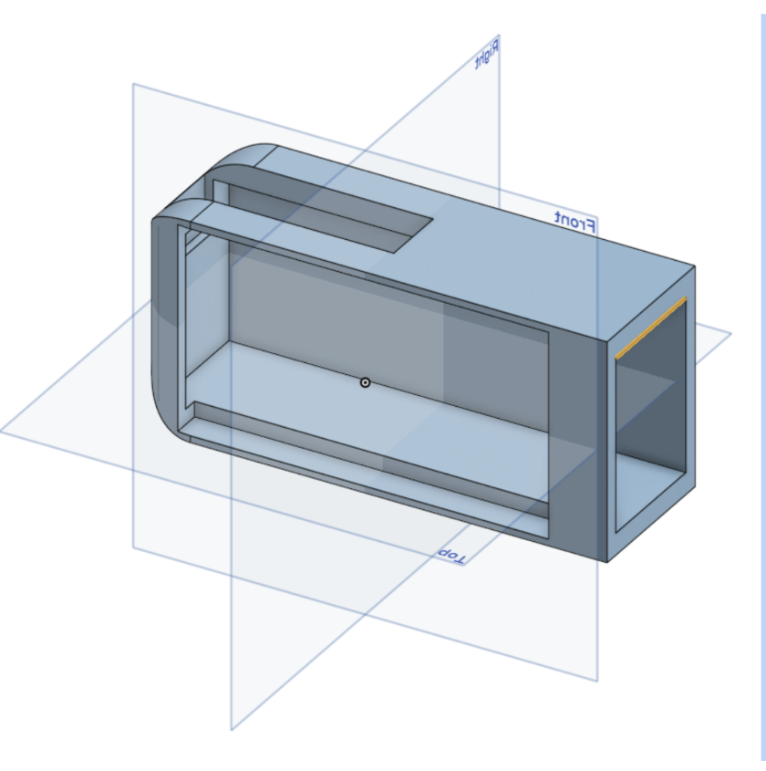
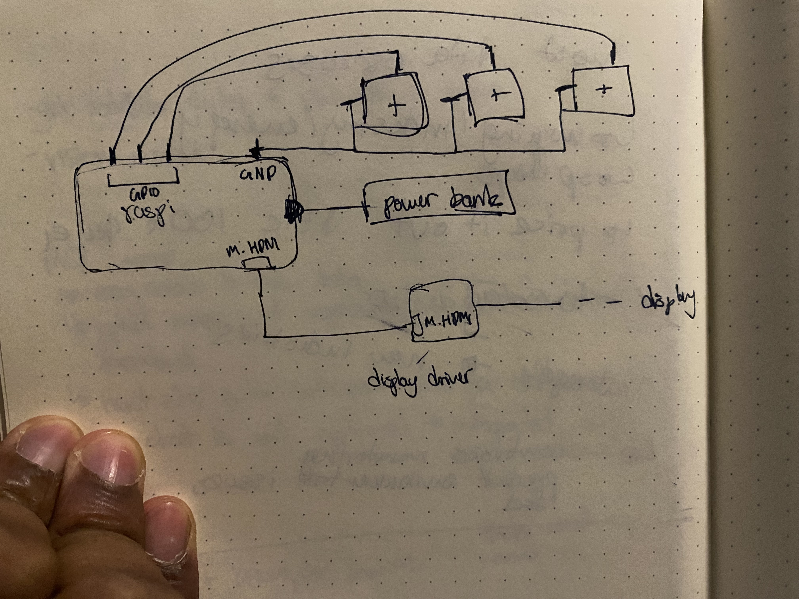

Total Hours: 6

29 June 2025: 4 Hours

-   Started the project this evening and got the following done

-   Gathered design inspo from retro car dashboards and such for this project onto a [Pinterest Board](https://pin.it/3RkpYdUsZ)
-   Drafted up some mockup designs for how the dashboard will look in [Figma](https://www.figma.com/design/asrEkvQnpRTlTKvGopl8YJ/Untitled?node-id=1-2&t=SUWxltnkHklI4Q8a-1)
-   Made a case for the dashpad in CAD
    -   will probably tweak this a bit more before I print this out
        

30 June 2025: 2 Hours

-   working into the night, struggled getting KiCad setup and spent time figuring out how to use it
-   Started and finished up design for the PCB (it was really easy since its only a simple 3 key desing)
-   started creating github and submission for project
-   created wiring diagram with raspi + switches + display
-   used KMK to create firmware, just 3 switches each binded to a commonly unused function key (F18,19, 20)
-   realized that PCB is unneeded if i'm going to use Raspi, i can just wire up directly to the raspi without an issue

**wiring diagram**

2 July 2025: 2 hours
- fixed up some issues with submission
- redid my case design to meet requirements