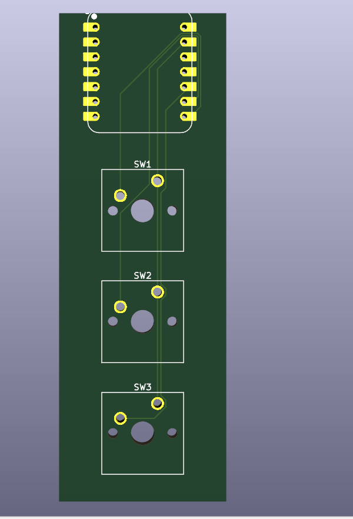

# Dashpad

## Inspo

I wanted a clean, minimal, always-on desktop dashboard. I also wanted some way to "smart" control my desk height + lights. Decided to make a macropad + dashboard in-one combo.

I also love the retro-digital aesthetic and was inspired by the old-school industrial/futuristic car dashboards.

So I decided to combine those two aspects. Use that aesthetic with modern data (Spotify, weather, calendar, etc.) and useful desk macros (move desk up/down, toggle lights) and make it into one cohesive package.

## Cool Features + Spec List

-   Always-on 5.5" OLED display: clock, timer, weather, calendar, Spotify and such

-   3 macro keys (via XIAO RP2040) to:

    -   Standing desk control + lights control (endlesss options due to connection with homeasistant)

    -   Connected to Home Assistant running on the same Pi

## Build Plan

Focusing on hardware first, will deal with software later. I will 3D print on my own.

1. Wire up Pi Zero 2 W to the AMOLED screen (USB-C driver board)

2. Prototype macro keys on XIAO RP2040 running KMK custom firmware. Wire up Raspi to OLED screen and connect to internal powerbank. connect xiao to computer.

3. Assemble into 3D print case, refine later once screen and keys are locked in

4. Hook everything to Home Assistant for desk automation on the raspi

5. Later: build simple Python/Node app to render dashboard data + setup up homeassistant to view stats + telemetry on the raspi

## Pictures

## BOM

| Item                                                    |  Price | Link                                                                              |
| ------------------------------------------------------- | -----: | --------------------------------------------------------------------------------- |
| OLED Screen 5.5” (1920×1080 AMOLED, USB-C driver board) |   Free | Owned                                                                             |
| Raspberry Pi Zero 2 W                                   | $15USD (self-buy) | [PiShop.ca](https://www.pishop.ca/product/raspberry-pi-zero-2-w/?src=raspberrypi) |
| 3× mechanical key switches                              |     HC | From Approved Parts                                                               |
| Keycaps                                                 |   HC | From Approved Parts                                                             |
| 3D printed case & mounts                                |   Free | Custom design + printed                                                           |
| Wires, header pins, screws                              |   Free | Owned                                                                             |
| Custom PCB                                              |     $27USD | From Approved Parts                                                               |
| Xiao RP2040 | HC | From Approved parts|
| Powerbank | Free | Owned |
